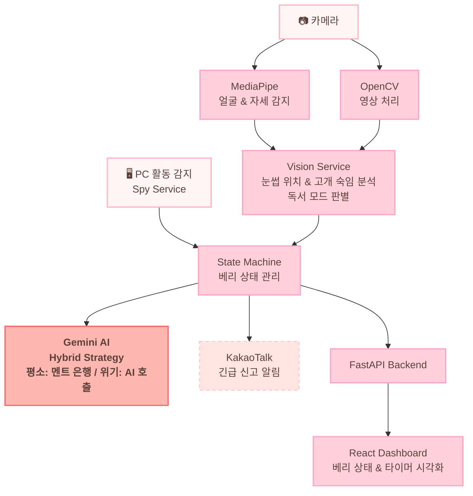
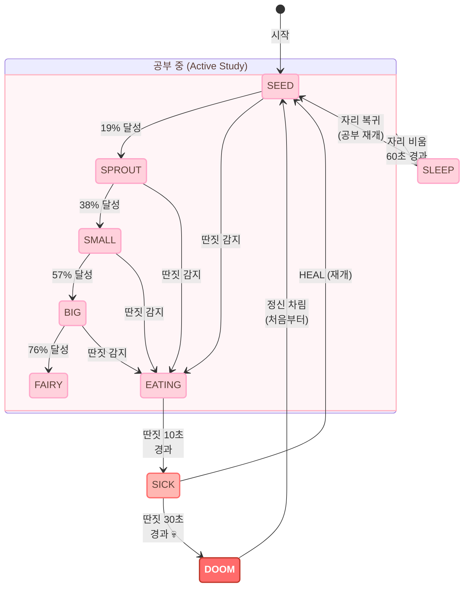

# 🍓 Focus Mate Berry (포커스 메이트 베리)


> **"당신의 집중이 베리를 성장시킵니다!"**  
> 포커스 메이트 베리는 사용자의 집중도와 자세를 실시간으로 모니터링하여 함께 성장하는 AI 공부 친구입니다.

<p align="left">
  
  
  
  
  
</p>

---

## 🌟 주요 기능

### 1. 🌱 베리 성장 시스템
사용자가 집중해서 공부하는 시간에 따라 베리가 5단계로 진화합니다!
- **씨앗(Seed) → 새싹(Sprout) → 작은 열매(Small) → 큰 딸기(Big) → 요정 베리(Fairy)**
- 집중이 깨지면 베리가 아프거나(`SICK`), 딴짓의 늪(`DOOM`)에 빠질 수 있으니 주의하세요!

### 2. 🐢 스마트 자세 교정 (거북목 방지)
- **눈썹 위치 기반 감지**: 독서대 없이 고개를 너무 깊게 숙이면 베리가 거북목 주의 알림을 보냅니다.
- **자동 휴식 전환**: 나쁜 자세가 지속되면 베리가 잠(`SLEEP`)에 들어 사용자의 휴식을 유도합니다.

### 3. 🕵️ PC 활동 및 자리 비움 감지
- **스파이 서비스**: 업무/공부와 관련 없는 앱(메신저, 게임, 유튜브 등) 사용을 실시간으로 감지합니다.
- **부재중 감지**: 사용자가 자리를 비우면 공부 시간을 자동으로 일시 정지하고 대기 모드로 전환합니다.

### 4. 🤖 AI 상호작용 & 긴급 신고
- **Gemini AI**: 베리는 Google의 Gemini AI를 통해 사용자의 상태에 맞는 다정하고 똑똑한 응원 메시지를 건넵니다.
- **카카오톡 알림**: 사용자가 너무 오랫동안 딴짓을 하면, 베리가 보호자에게 "긴급 신고" 카톡을 보냅니다.

### 5. 📊 대시보드 및 리모컨
- **실시간 대시보드**: React 기반의 예쁜 웹 화면에서 베리의 상태와 공부 시간을 확인할 수 있습니다.
- **원격 제어**: 웹 화면의 버튼을 통해 베리를 시작하거나, 멈추거나, 아픈 베리를 치료(`HEAL`)해줄 수 있습니다.

---
## ⚙️ System Architecture



---


## 🌱 Berry State Machine




---

## 🎮 로직 시뮬레이터 (Logic Simulator)

프로젝트를 실제로 실행하기 전, 베리가 어떻게 반응하는지 미리 체험해볼 수 있는 시뮬레이터를 제공합니다.

[**👉 시뮬레이터 체험하기 (Live Demo)**](https://hoilycat.github.io/Focus-Mate-Berry/simulator.html)


1.  프로젝트 루트 폴더의 `simulator.html` 파일을 웹 브라우저로 열거나 위 링크를 클릭합니다.
2.  **눈썹 높이(Eyebrow Y)** 슬라이더를 조절하여 거북목 감지 로직을 테스트합니다.
3.  **딴짓 위험도(Risk Meter)** 슬라이더를 조절하여 베리의 건강 상태 변화를 확인합니다.

---

## 🛠 기술 스택

### **Frontend**
- React (Vite), Tailwind CSS

### **Backend & Logic**
- **Core**: Python
- **API**: FastAPI, Uvicorn
- **Database**: SQLite (로그 및 업적 저장)

### **AI & Vision**
- **Vision**: MediaPipe (얼굴 인식 및 자세 추적), OpenCV
- **AI**: Google Gemini API (대화 생성)
- **Messenger**: KakaoTalk Messaging API

---

## 🚀 시작하기

### 1. 환경 설정
프로젝트 루트에 `.env` 파일을 만들고 필요한 API 키를 설정하세요.
```env
GEMINI_API_KEY=your_gemini_api_key
KAKAO_API_KEY=your_kakao_api_key
KAKAO_CLIENT_SECRET=your_kakao_secret
```

### 2. 필요한 패키지 설치
```bash
pip install -r requirements.txt
cd berry-react && npm install
```

### 3. 실행 방법
**Step 1: 메인 로직 실행 (카메라 및 감지 시작)**
```bash
python main.py
```

**Step 2: 백엔드 API 실행**
```bash
python backend_api.py
```

**Step 3: 웹 대시보드 실행**
```bash
cd berry-react
npm run dev
```

---

## 📂 프로젝트 구조
- `main.py`: 전체 시스템의 메인 실행 루프
- `backend_api.py`: 웹 대시보드와 통신하기 위한 API 서버
- `services/`:
  - `vision_service.py`: 카메라 인식 및 자세 감지
  - `spy_service.py`: PC 활동 감시
  - `ai_service.py`: Gemini AI 기반 대화 생성
  - `state_machine.py`: 베리의 상태 관리 로직
  - `messenger_service.py`: 카카오톡 알림 전송
- `berry-react/`: React 기반 웹 프론트엔드 소스코드

---

## 💖 기여 및 문의
베리와 함께 더 즐겁게 공부하고 싶다면 언제든 피드백을 주세요!  
**Focus Mate Berry**와 함께 목표를 달성해 보세요! 🍓🔥
